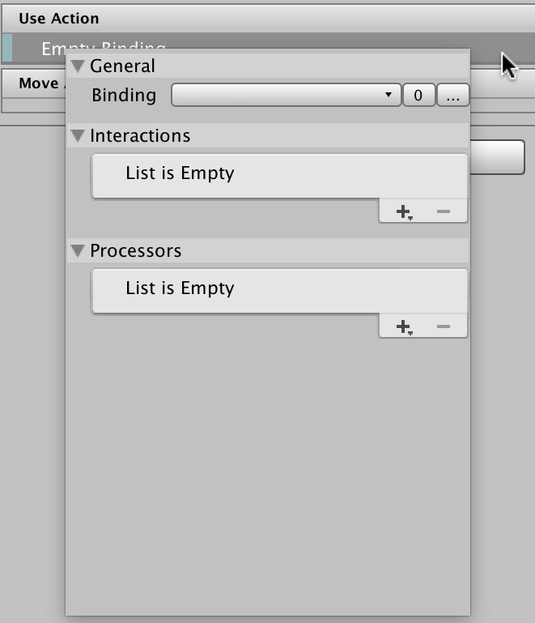
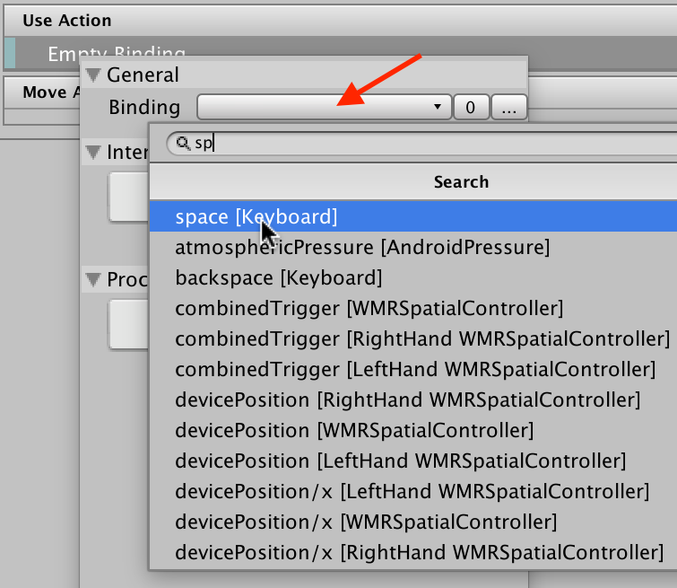
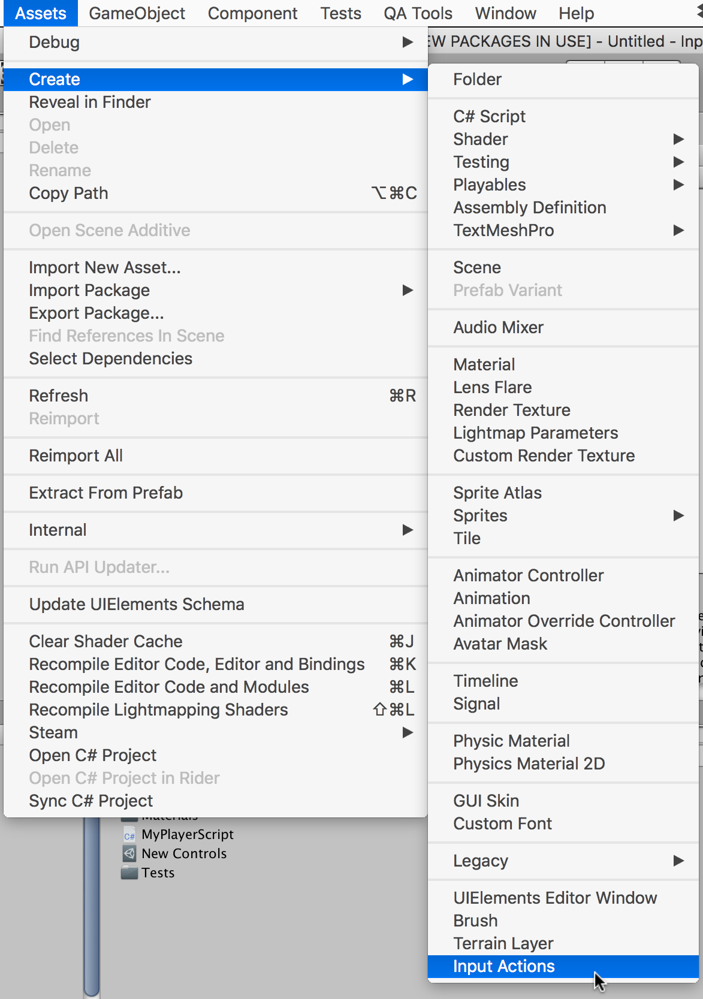
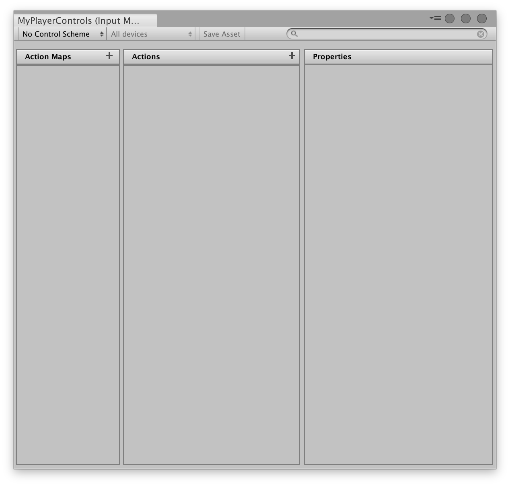

# Quick Start Guide

>NOTE: For information on how to install the new input system, please see [Installation](Installation.md).

## Getting Input Directly From An Input Device

The quickest way to get started in script is to just query state directly from input devices. For example, the following code grabs the gamepad last used by the player and reads out its current state:

```CSharp
using UnityEngine;
using UnityEngine.Experimental.Input;

public class MyPlayerScript : MonoBehaviour
{
    void FixedUpdate()
    {
        var gamepad = Gamepad.current;
        if (gamepad == null)
            return; // No gamepad connected.

        if (gamepad.rightTrigger.wasPressedThisFrame)
        {
            // 'Use' code here
        }

        Vector2 move = gamepad.leftStick.ReadValue();
        // 'Move' code here
    }
}
```

The same approach works for other types of devices, e.g. `Keyboard.current`, `Mouse.current`, `Touchscreen.current`, etc.

# Getting Input Indirectly Through An Input Action

Getting input directly from an input device is quick and convenient but requires a separate path for each type of device and also makes it hard to later change which control on the device leads to which action being taken by the game.

An alternative is to use actions as an intermediary between input devices and the responses they trigger in the game:

```CSharp
using UnityEngine;
using UnityEngine.Experimental.Input;

public class MyPlayerScript : MonoBehaviour
{
    public InputAction useAction;
    public InputAction moveAction;

    public Awake()
    {
        useAction.performed += OnUse;
        moveAction.performed += OnMove;
    }

    public OnEnable()
    {
        useAction.Enable();
        moveAction.Enable();
    }

    public OnDisable()
    {
        useAction.Disable();
        moveAction.Disable();
    }

    public void OnUse(InputAction.CallbackContext context)
    {
        // 'Use' code here.
    }

    public void OnMove(InputAction.CallbackContext context)
    {
        // 'Move' code here.
    }

}
```

After adding this component to a `GameObject`, the actions on the component can be graphically edited in the inspector. We can add bindings to actions by clicking the plus icon for an action.


Double-click the newly added binding to show its properties.



Click the path dropdown on the binding to show the control picker. You can either search for controls by name or navigate to them by going through the hierarchy.



# Moving The Actions Into An Asset

Unfortunately, as more actions are added, this approach gets unwieldy fast. To simplify handling of the actions, we can move all of them into an asset and use the action asset editor instead of configuring actions directly on a component.

To create the asset, right-click in the Project window or open the `Assets` entry in Unity's main menu. From there, select `Create >> Input Actions`.



Give the asset a name (such as `MyPlayerControls`) and double-click the asset to open the action editor.



The left column contains the "action maps" in the asset. Each map is a collection of actions that can be enabled and disabled in bulk. The middle column contains the actions in the map that is selected. And the right-most column contains the properties of the action or binding selected in the middle column.

Click the plus icon next to "Action Maps" to add new action maps and the plus icon next to "Actions" to add new actions.

...

# Adding Control Schemes

...

# Adding UI Support

...
